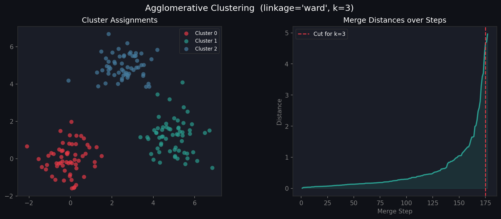

# 🟢 Agglomerative Hierarchical Clustering from Scratch

A pure Python implementation of **Agglomerative (Bottom-Up) Hierarchical Clustering** using NumPy and Matplotlib. Supports four linkage strategies: `single`, `complete`, `average`, and `ward`.

---

## 📊 Output



> **Left:** Final cluster assignments  
> **Right:** Merge distances at each step — the red line shows where to "cut" for k clusters

---

## ✨ Features

| Feature | Details |
|---|---|
| **4 linkage methods** | `single`, `complete`, `average`, `ward` |
| **Merge history** | Full record of every merge with distance |
| **Cut visualisation** | Shows optimal cut point for chosen k |
| **sklearn-style API** | `fit`, `fit_predict` |

---

## 🔗 Linkage Methods Explained

| Linkage | Distance Between Clusters | Best For |
|---|---|---|
| `single` | Minimum pairwise distance | Chained/elongated shapes |
| `complete` | Maximum pairwise distance | Compact, equal-sized clusters |
| `average` | Mean pairwise distance | General purpose |
| `ward` | Minimises within-cluster variance | Most common, balanced clusters |

---

## 🚀 Quickstart

```bash
git clone https://github.com/YOUR_USERNAME/agglomerative-clustering.git
cd agglomerative-clustering
pip install numpy matplotlib
python agglomerative.py
```

---

## 🧑‍💻 Usage

```python
from agglomerative import Agglomerative
import numpy as np

X = np.random.randn(150, 2)

model = Agglomerative(k=3, linkage="ward")
labels = model.fit_predict(X)

# Inspect merge history
for step, (a, b, dist) in enumerate(model.merge_history[:5]):
    print(f"Step {step+1}: merged cluster {a} + {b} at dist={dist:.3f}")
```

---

## 🔧 API Reference

### `Agglomerative(k, linkage)`

| Parameter | Default | Description |
|---|---|---|
| `k` | `3` | Number of final clusters |
| `linkage` | `"ward"` | Linkage criterion |

### Methods

| Method | Description |
|---|---|
| `.fit(X)` | Fit the model |
| `.fit_predict(X)` | Fit and return labels |

### Attributes

| Attribute | Description |
|---|---|
| `.labels` | Cluster assignment for each point |
| `.merge_history` | List of `(cluster_a, cluster_b, distance)` tuples |

---

## 📐 Algorithm

1. **Initialise:** Each of n points is its own cluster
2. **Find** the two closest clusters (using chosen linkage)
3. **Merge** them into one cluster
4. **Repeat** until k clusters remain

Ward linkage distance formula:

$$d(A, B) = \sqrt{\frac{n_A \cdot n_B}{n_A + n_B}} \cdot \|\mu_A - \mu_B\|$$

---

## 📁 Project Structure

```
agglomerative-clustering/
├── agglomerative.py   # Implementation + demo
├── output.png         # Output visualization
└── README.md
```

---

## 📦 Dependencies

- `numpy` · `matplotlib`

## 📄 License

MIT
