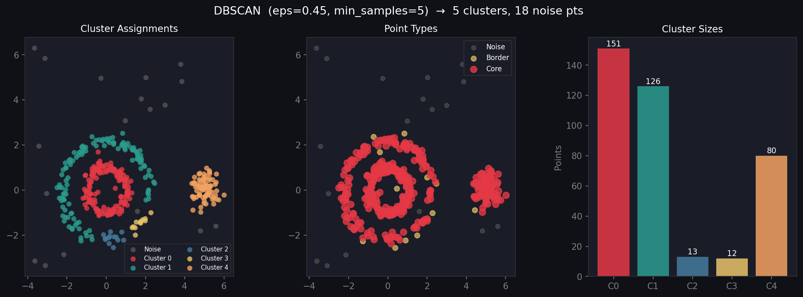

# 🔵 DBSCAN Clustering from Scratch

A pure Python implementation of **DBSCAN (Density-Based Spatial Clustering of Applications with Noise)** using NumPy and Matplotlib. Finds clusters of arbitrary shape and automatically labels outliers as noise.

---

## 📊 Output



> **Left:** Cluster assignments (grey = noise)  
> **Middle:** Point types — core (red), border (yellow), noise (grey)  
> **Right:** Cluster size distribution

---

## ✨ Features

| Feature | Details |
|---|---|
| **Arbitrary shapes** | Discovers rings, crescents, blobs |
| **Noise detection** | Automatically labels outliers |
| **Core/border/noise** | Classifies every point by density role |
| **No k required** | Number of clusters found automatically |
| **sklearn-style API** | `fit`, `fit_predict` |

---

## 🌀 Why DBSCAN?

| | K-Means | DBSCAN |
|---|---|---|
| Cluster shape | Convex (spherical) | **Arbitrary** |
| Outliers | Assigned to nearest cluster | **Labelled as noise** |
| k required | Yes | **No** |
| Scales with density | No | **Yes** |

---

## 🚀 Quickstart

```bash
git clone https://github.com/YOUR_USERNAME/dbscan-clustering.git
cd dbscan-clustering
pip install numpy matplotlib
python dbscan.py
```

---

## 🧑‍💻 Usage

```python
from dbscan import DBSCAN
import numpy as np

X = np.random.randn(300, 2)

model = DBSCAN(eps=0.5, min_samples=5)
labels = model.fit_predict(X)

print(f"Clusters: {model.n_clusters}")
print(f"Noise points: {model.n_noise}")
print(f"Core points: {model.core_mask.sum()}")
```

---

## 🔧 API Reference

### `DBSCAN(eps, min_samples)`

| Parameter | Default | Description |
|---|---|---|
| `eps` | `0.5` | Neighbourhood radius ε |
| `min_samples` | `5` | Min points to form a core point |

### Methods

| Method | Description |
|---|---|
| `.fit(X)` | Fit the model |
| `.fit_predict(X)` | Fit and return labels |

### Attributes

| Attribute | Description |
|---|---|
| `.labels` | Cluster labels (`-1` = noise) |
| `.n_clusters` | Number of clusters found |
| `.n_noise` | Number of noise points |
| `.core_mask` | Boolean mask of core points |

---

## 📐 Algorithm

1. For each unvisited point p:
   - Find all points within ε (**region query**)
   - If `|neighbours| < min_samples` → label as **noise**
   - Else → start new cluster, **expand** via BFS through dense neighbours
2. Any point reachable from a core point → **border point**

**Point types:**
- **Core point:** ≥ `min_samples` points within ε
- **Border point:** within ε of a core point, but not itself a core
- **Noise:** not reachable from any core point

---

## 🎛️ Choosing Parameters

| Situation | Advice |
|---|---|
| Too many clusters | Increase `eps` or decrease `min_samples` |
| Too much noise | Decrease `min_samples` or increase `eps` |
| Finding `eps` | Use k-distance graph (plot sorted distances to k-th neighbour) |

---

## 📁 Project Structure

```
dbscan-clustering/
├── dbscan.py      # Implementation + demo
├── output.png     # Output visualization
└── README.md
```

---

## 📦 Dependencies

- `numpy` · `matplotlib`

## 📄 License

MIT
