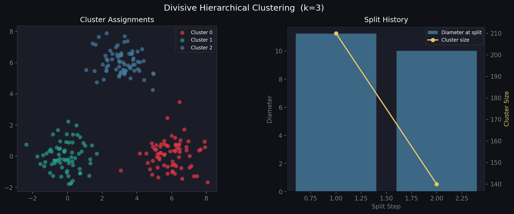

# 🟡 Divisive Hierarchical Clustering from Scratch

A pure Python implementation of **Divisive (Top-Down) Hierarchical Clustering** (DIANA-style) using NumPy and Matplotlib. Starts with all points in one cluster and recursively splits until k clusters remain.

---

## 📊 Output



> **Left:** Final cluster assignments  
> **Right:** Diameter and size of each cluster at the moment of splitting

---

## ✨ Features

| Feature | Details |
|---|---|
| **DIANA-style splitting** | Greedy splinter group algorithm |
| **Diameter-based selection** | Splits the most dispersed cluster first |
| **Split history** | Records size & diameter at every split |
| **sklearn-style API** | `fit`, `fit_predict` |

---

## 🔄 Divisive vs Agglomerative

| | Agglomerative (Bottom-Up) | Divisive (Top-Down) |
|---|---|---|
| Starts with | n clusters (each point alone) | 1 cluster (all points) |
| Direction | Merges → fewer clusters | Splits → more clusters |
| Complexity | O(n³) naïve | O(2ⁿ) exact, O(n²) greedy |
| Best for | Small datasets | Large, well-separated data |

---

## 🚀 Quickstart

```bash
git clone https://github.com/YOUR_USERNAME/divisive-clustering.git
cd divisive-clustering
pip install numpy matplotlib
python divisive.py
```

---

## 🧑‍💻 Usage

```python
from divisive import Divisive
import numpy as np

X = np.random.randn(200, 2)

model = Divisive(k=4)
labels = model.fit_predict(X)

# View split history
for step, (size, diam) in enumerate(model.split_history):
    print(f"Split {step+1}: cluster of size={size}, diameter={diam:.3f}")
```

---

## 🔧 API Reference

### `Divisive(k)`

| Parameter | Default | Description |
|---|---|---|
| `k` | `3` | Number of final clusters |

### Methods

| Method | Description |
|---|---|
| `.fit(X)` | Fit the model |
| `.fit_predict(X)` | Fit and return labels |

### Attributes

| Attribute | Description |
|---|---|
| `.labels` | Cluster assignment for each point |
| `.split_history` | List of `(cluster_size, diameter)` at each split |

---

## 📐 Algorithm (DIANA-style)

1. **Start** with all n points in one cluster
2. **Select** the cluster with the largest diameter to split
3. **Splinter step:**
   - Find the point most dissimilar to all others → seed splinter group
   - Move points closer to the splinter mean than the main mean
4. **Repeat** until k clusters remain

Cluster diameter:
$$\text{diameter}(C) = \max_{x_i, x_j \in C} d(x_i, x_j)$$

---

## 📁 Project Structure

```
divisive-clustering/
├── divisive.py    # Implementation + demo
├── output.png     # Output visualization
└── README.md
```

---

## 📦 Dependencies

- `numpy` · `matplotlib`

## 📄 License

MIT
