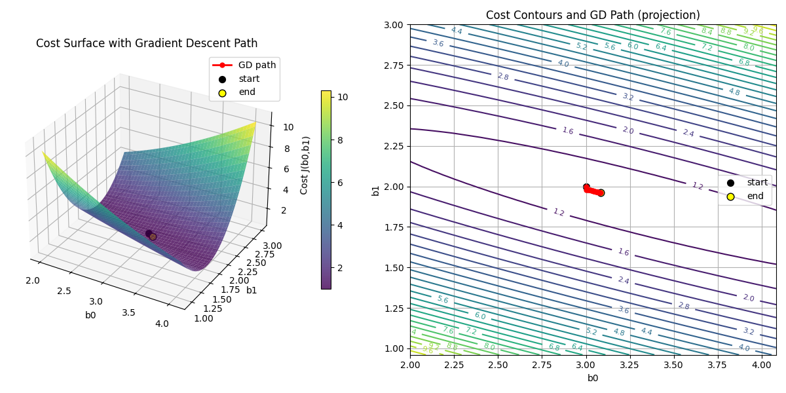

# Gradient Descent from Scratch (Python)

This project implements **gradient descent from scratch** to optimize a linear regression model, without relying on high-level ML libraries.

---

## 📌 Problem Statement
Optimize model parameters by minimizing mean squared error using gradient descent.

---

## ⚙️ How It Works
- Initialize weights randomly
- Compute predictions
- Calculate loss (MSE)
- Update weights using gradient
- Repeat until convergence

---

## 📊 Output
The algorithm produces:
- Loss reduction over iterations
- Final optimized parameters
- Visualization of convergence

---

## 🛠 Tech Used
- Python
- NumPy
- Matplotlib

---

## 🎯 Key Learnings
- How gradient descent actually updates parameters
- Effect of learning rate on convergence
- Difference between convergence and divergence

---

## 🚀 Future Improvements
- Add support for multiple variables
- Compare with scikit-learn implementation
