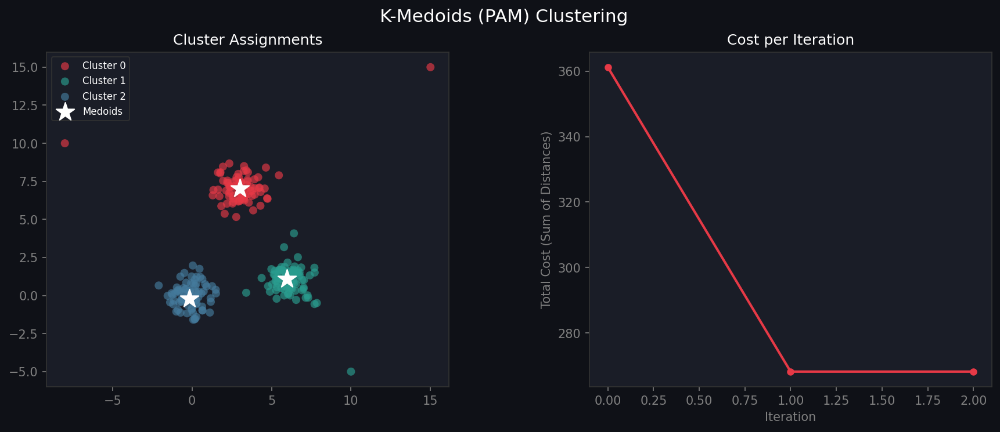

# 🔴 K-Medoids Clustering (PAM) from Scratch

A pure Python implementation of the **K-Medoids (PAM — Partitioning Around Medoids)** algorithm using only NumPy and Matplotlib. Unlike K-Means, cluster centers are **actual data points**, making it robust to outliers.

---

## 📊 Output



> **Left:** Cluster assignments with medoids (★) — note outliers don't skew centers  
> **Right:** Total cost convergence per swap iteration

---

## ✨ Features

| Feature | Details |
|---|---|
| **PAM algorithm** | Full swap-based optimization |
| **K-Means++ init** | Smart seeding for faster convergence |
| **Outlier robust** | Centers always real data points |
| **Cost tracking** | Plots total distance cost per iteration |
| **sklearn-style API** | `fit`, `predict`, `fit_predict` |

---

## 🔑 K-Medoids vs K-Means

| | K-Means | K-Medoids |
|---|---|---|
| Center type | Mean (may not exist in data) | Actual data point |
| Outlier sensitivity | High | **Low** |
| Distance metric | Euclidean only | Any metric |
| Complexity | O(nkt) | O(n²kt) |

---

## 🚀 Quickstart

```bash
git clone https://github.com/YOUR_USERNAME/kmedoids-clustering.git
cd kmedoids-clustering
pip install numpy matplotlib
python kmedoids.py
```

---

## 🧑‍💻 Usage

```python
from kmedoids import KMedoids
import numpy as np

X = np.random.randn(200, 2)

km = KMedoids(k=3, init="kmeans++")
km.fit(X)

print("Medoid indices:", km.medoid_indices)
print("Medoids:\n", km.medoids)
print("Cost:", km.cost)

labels = km.predict(X)
```

---

## 🔧 API Reference

### `KMedoids(k, max_iters, init)`

| Parameter | Default | Description |
|---|---|---|
| `k` | `3` | Number of clusters |
| `max_iters` | `100` | Max swap iterations |
| `init` | `"kmeans++"` | `"kmeans++"` or `"random"` |

### Methods

| Method | Description |
|---|---|
| `.fit(X)` | Fit the model |
| `.predict(X)` | Predict on new data |
| `.fit_predict(X)` | Fit and return labels |

### Attributes

| Attribute | Description |
|---|---|
| `.medoid_indices` | Indices of medoids in X |
| `.medoids` | Medoid coordinates |
| `.cost` | Final total cost |
| `._cost_history` | Cost at each iteration |

---

## 📐 Algorithm (PAM)

1. **Initialize** k medoids (K-Means++ or random)
2. **Assign** each point to nearest medoid
3. **For each medoid m and non-medoid o:**
   - Swap m with o if total cost decreases
4. **Repeat** until no swap improves cost

$$\text{Cost} = \sum_{i=1}^{n} d(x_i,\ \text{medoid}(\text{cluster}(x_i)))$$

---

## 📁 Project Structure

```
kmedoids-clustering/
├── kmedoids.py    # Implementation + demo
├── output.png     # Output visualization
└── README.md
```

---

## 📦 Dependencies

- `numpy` · `matplotlib`

## 📄 License

MIT
