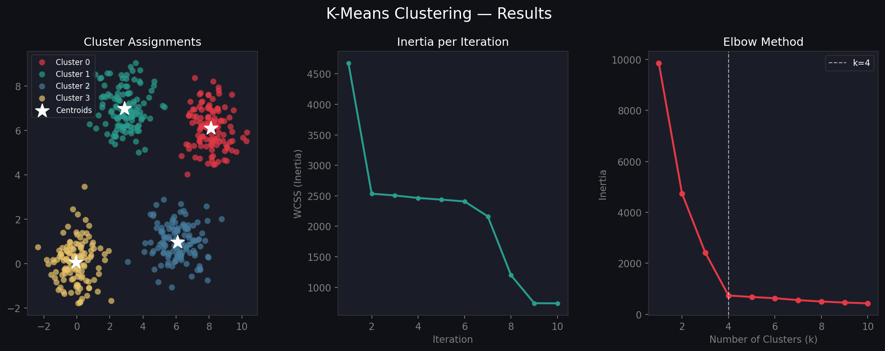

# 🔵 K-Means Clustering from Scratch

A clean, well-documented Python implementation of the K-Means clustering algorithm — built without scikit-learn, using only **NumPy** and **Matplotlib**.

---

## 📊 Output



> **Left:** Cluster assignments with centroids (★)  
> **Middle:** Inertia (WCSS) convergence per iteration  
> **Right:** Elbow method to find optimal `k`

---

## ✨ Features

| Feature | Details |
|---|---|
| **K-Means++ init** | Smarter centroid seeding for faster convergence |
| **Random init** | Classic random initialization |
| **Convergence detection** | Stops early when centroid shift < tolerance |
| **Elbow method** | Automatically plots inertia vs `k` |
| **sklearn-style API** | `fit`, `predict`, `fit_predict` |
| **Dark-themed plots** | 3-panel output: clusters, convergence, elbow |

---

## 🚀 Quickstart

### 1. Clone the repo
```bash
git clone https://github.com/YOUR_USERNAME/kmeans-clustering.git
cd kmeans-clustering
```

### 2. Install dependencies
```bash
pip install numpy matplotlib
```

### 3. Run the demo
```bash
python kmeans.py
```

---

## 🧑‍💻 Usage

```python
import numpy as np
from kmeans import KMeans

# Your data
X = np.random.randn(300, 2)

# Fit
km = KMeans(k=3, init="kmeans++")
km.fit(X)

# Predict on new data
labels = km.predict(X)

print("Centroids:", km.centroids)
print("Inertia:", km.inertia)
```

---

## 🔧 API Reference

### `KMeans(k, max_iters, tol, init)`

| Parameter | Default | Description |
|---|---|---|
| `k` | `3` | Number of clusters |
| `max_iters` | `100` | Max iterations |
| `tol` | `1e-4` | Convergence tolerance |
| `init` | `"kmeans++"` | `"kmeans++"` or `"random"` |

### Methods

| Method | Description |
|---|---|
| `.fit(X)` | Fit the model to data |
| `.predict(X)` | Predict cluster labels |
| `.fit_predict(X)` | Fit and return labels |
| `KMeans.find_elbow(X, k_range)` | Compute inertias for elbow plot |

---

## 📐 Algorithm

1. **Initialize** centroids using K-Means++ (or random)
2. **Assign** each point to the nearest centroid
3. **Update** centroids to the mean of assigned points
4. **Repeat** until convergence (centroid shift < `tol`)

The cost function minimized is the **Within-Cluster Sum of Squares (WCSS)**:

$$\text{Inertia} = \sum_{j=1}^{k} \sum_{x \in C_j} \| x - \mu_j \|^2$$

---

## 📁 Project Structure

```
kmeans-clustering/
├── kmeans.py       # Main implementation + demo
├── output.png      # Generated cluster plot
└── README.md       # This file
```

---

## 📦 Dependencies

- `numpy`
- `matplotlib`

---

## 📄 License

MIT License — free to use, modify, and distribute.
