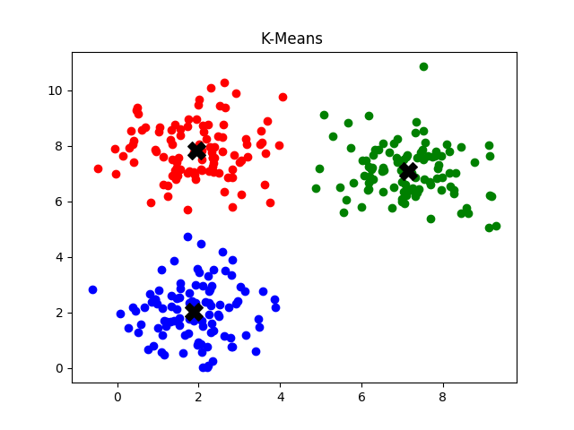

# K-Means Clustering from Scratch

Implementation of the K-Means clustering algorithm in Python without using sklearn.

## Features

- Pure Python implementation
- Random centroid initialization
- Euclidean distance clustering
- Visualization using matplotlib

## How it Works

1. Initialize K centroids randomly
2. Assign each point to nearest centroid
3. Recompute centroids
4. Repeat until convergence

## Example Output

## Run

pip install -r requirements.txt

python main.py
