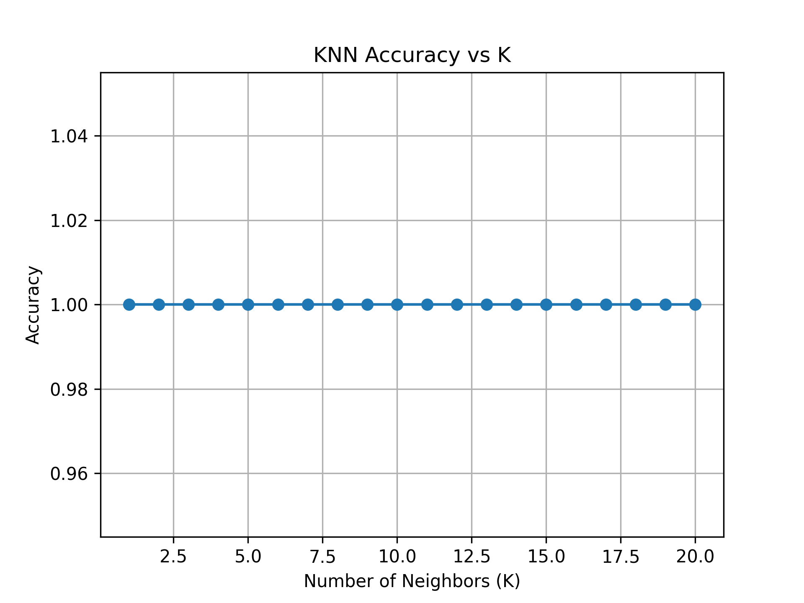

# K-Nearest Neighbors (KNN) – Accuracy vs K Analysis

This project implements and analyzes the **K-Nearest Neighbors (KNN)** classification algorithm using Python.  
The goal is to understand how the choice of **K** affects model performance and why proper preprocessing is critical.

---

## 📌 Problem Statement

KNN is a distance-based algorithm whose performance is highly sensitive to the value of **K**.  
This project studies how accuracy changes with different K values and identifies the optimal K for a given dataset.

---

## 📂 Project Structure

- knn.py

- dataset.csv # Dataset used for training and testing
- accuracy_vs_k.png # Accuracy vs K visualization
- results.txt # Accuracy values and best K
- README.md

---

## ⚙️ Approach

1. Load dataset
2. Split data into training and testing sets
3. Apply **feature scaling** (mandatory for KNN)
4. Train KNN for multiple K values
5. Evaluate accuracy for each K
6. Visualize accuracy vs K
7. Identify best-performing K

---

## 📊 Output

### Accuracy vs K
The following plot shows how classification accuracy varies with different values of K:

The results clearly demonstrate:
- **Small K** → overfitting  
- **Large K** → underfitting  
- **Optimal K** balances bias and variance

---

## 📄 Results Summary

All numerical results are saved in `results.txt`, including:
- Accuracy for each K
- Best K value
- Best achieved accuracy

---

## 🛠 Tech Stack

- Python  
- Pandas  
- NumPy  
- Matplotlib  
- scikit-learn  

---

## 🧠 Key Learnings

- KNN performance depends heavily on hyperparameter selection
- Feature scaling is essential for distance-based algorithms
- Bias–variance tradeoff is clearly visible through K variation
- Visualization makes model behavior easier to interpret

---

## 🚀 Future Improvements

- Compare KNN with Logistic Regression or SVM
- Test on larger, real-world datasets
- Add cross-validation instead of single train-test split

---

*This project focuses on understanding algorithm behavior rather than treating models as black boxes.*
